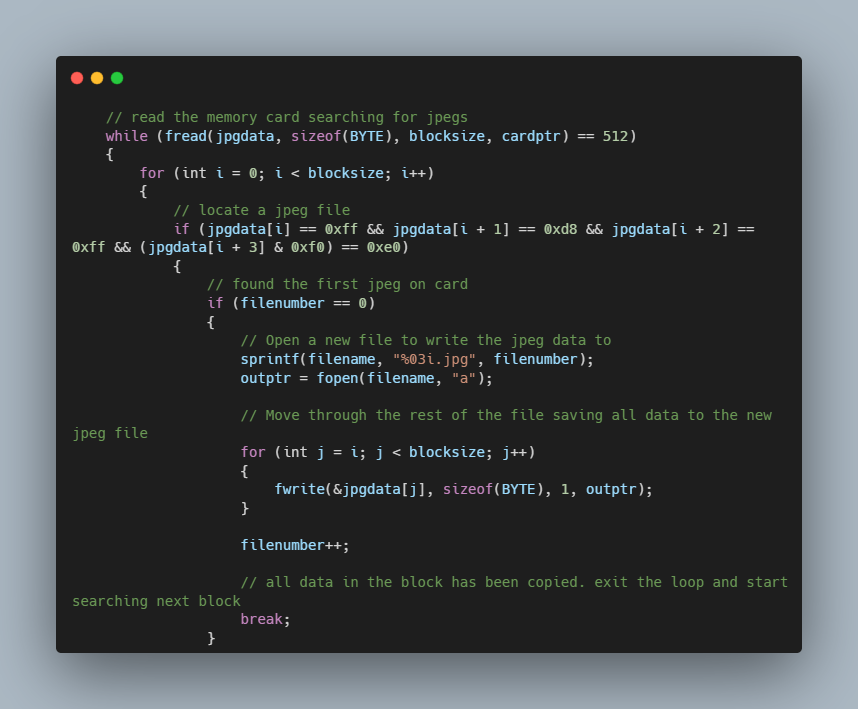

# Recover - CS50

### Description

Fortunately, digital cameras tend to store photographs contiguously on memory cards, whereby each photo is stored immediately after the previously taken photo. Accordingly, the start of a JPEG usually demarks the end of another. However, digital cameras often initialize cards with a FAT file system whose “block size” is 512 bytes (B). The implication is that these cameras only write to those cards in units of 512 B. A photo that’s 1 MB (i.e., 1,048,576 B) thus takes up 1048576 ÷ 512 = 2048 “blocks” on a memory card. But so does a photo that’s, say, one byte smaller (i.e., 1,048,575 B)! The wasted space on disk is called “slack space.” Forensic investigators often look at slack space for remnants of suspicious data.

Implementing a program called recover that recovers JPEGs from a forensic image

### How to use

- The program accepts one command-line argument, the name of a forensic image from which to recover JPEGs
- Remind user of correct usage if requirements are not met.
- If the image cannot be opened for reading the user is informed returning 1

>>/recover
Usage: ./recover IMAGE

where IMAGE is the name of the forensic image. For example:

>>/recover card.raw

### Technologies
- C Programming
- Memory

### Code Snippet

### Links

[CS50](https://www.edx.org/course/introduction-computer-science-harvardx-cs50x?g_acctid=724-505-4034&g_campaign=gs-b2c-nonbrand-tier1geo-partner-harvard-core&g_campaignid=15417765031&g_adgroupid=131210224478&g_adid=588991333656&g_keyword=harvard%20cs50&g_keywordid=kwd-334019831226&g_network=g&utm_source=google&utm_campaign=gs-b2c-nonbrand-tier1geo-partner-harvard-core&utm_medium=cpc&utm_term=harvard%20cs50&hsa_acc=7245054034&hsa_cam=15417765031&hsa_grp=131210224478&hsa_ad=588991333656&hsa_src=g&hsa_tgt=kwd-334019831226&hsa_kw=harvard%20cs50&hsa_mt=e&hsa_net=adwords&hsa_ver=3&gclid=CjwKCAjwu5yYBhAjEiwAKXk_eJJGOIdTmi-A53VHyQGpzPNd1Gw5MWdUUwFq5cznbZ7IKnl8ctJNthoC8vAQAvD_BwE)